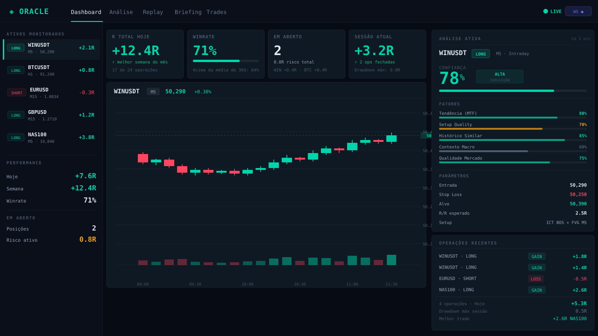
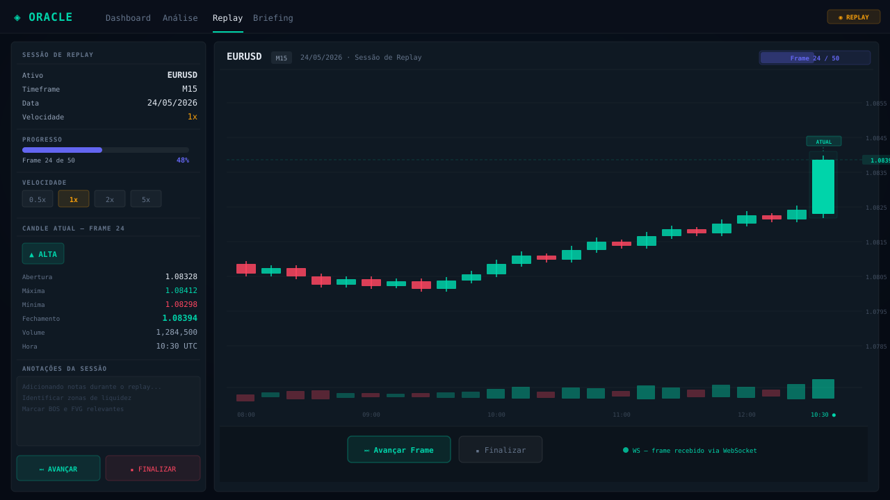
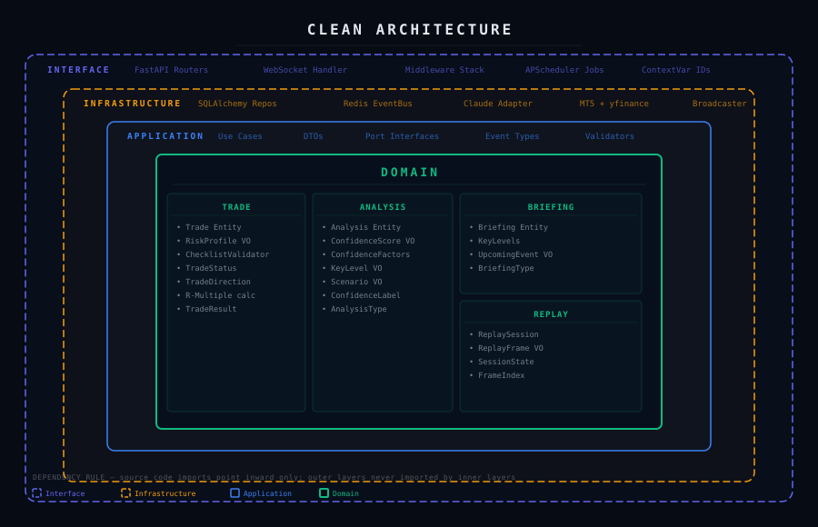
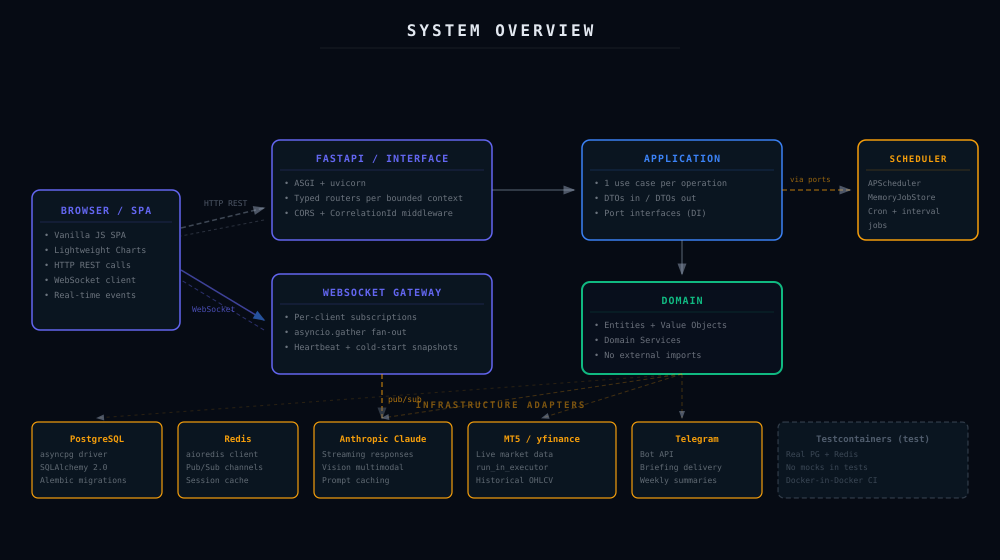

# Oracle Trader Assist

```
 ██████╗ ██████╗  █████╗  ██████╗██╗     ███████╗
██╔═══██╗██╔══██╗██╔══██╗██╔════╝██║     ██╔════╝
██║   ██║██████╔╝███████║██║     ██║     █████╗
██║   ██║██╔══██╗██╔══██║██║     ██║     ██╔══╝
╚██████╔╝██║  ██║██║  ██║╚██████╗███████╗███████╗
 ╚═════╝ ╚═╝  ╚═╝╚═╝  ╚═╝ ╚═════╝╚══════╝╚══════╝
  T R A D E R   A S S I S T
```

**AI-powered decision support platform for active day traders.**


---

## Overview

Oracle Trader Assist is a local-first analytical copilot that crosses technical chart analysis, trade journal history, macro calendar events, and real-time market data through Claude (Anthropic) to produce structured, confidence-scored trading decisions.

It is **not** a trade execution bot. It is a decision-support system — it helps the trader think, not trade automatically. The system captures every analysis and trade outcome, uses that history as context for future analyses, and exposes a full REST + WebSocket API consumed by its own SPA frontend.

> **Frontend preview:** `http://localhost:8000` after `make up && make migrate && uvicorn oracle.main:app --reload`

### Interface

<sub>Vector mockups of the SPA, rendered to match the shipped layout.</sub>





---

## Features

### Analysis Engine
- **`◈` AI Chart Analysis** — submits asset, timeframe, optional screenshot and context notes to Claude; returns structured suggestion (`OPERAR / AGUARDAR / NÃO OPERAR / REVISAR_CONTEXTO`), confidence score (0–100), trend direction/strength, support/resistance levels, bull/bear scenarios, and risk factors
- **`⬡` Chat — Oracle** — conversational interface with Claude, streaming token-by-token via WebSocket; falls back to REST if WS disconnected
- **`◐` Morning Briefing** — scheduled or on-demand briefing covering configured assets with support/resistance levels parsed from Claude's response

### Trade Management
- **`◉` Trade Journal** — register trades with full geometry validation (LONG/SHORT entry/stop/target relationships), emotional state tagging, and setup labeling
- **`◉` Close Trade** — record exit price and result; computes realized R (risk multiples) automatically
- **`◈` AI Reflection** — post-trade analysis by Claude: what worked, what didn't, behavioral patterns
- **`⬇` Export CSV** — full trade history exported with UTF-8 BOM for Excel compatibility

### Market Data
- **`⌖` Live Market** — 8 symbols (PETR4, VALE3, IBOV, WINQ, EURUSD, XAUUSD, US100, USDJPY) via Yahoo Finance with 3-second polling; falls back to `MockMarketAdapter` if Yahoo unavailable
- **Multi-timeframe grid** — per-symbol trend alignment across D1/H4/H1/M15/M5/M1
- **Economic calendar** — today's macro events via Finnhub (optional)
- **News context** — recent headlines injected into analysis prompts via NewsAPI (optional)

### Analytics
- **`▦` Performance dashboard** — win rate gauge, expected value (R), profit factor, max drawdown, daily P&L bars
- **30-day rolling metrics** and all-time summary

### Replay Engine
- **`⏵` Historical replay** — step through OHLCV frames of any asset/timeframe/date range
- **Candlestick chart** — Lightweight Charts v5 rendering candles frame by frame
- **AI frame annotation** — request Claude commentary at any replay point

### Risk & Pre-trade
- **`☑` Pre-trade checklist** — 14-item scored checklist (Setup/Context, Risk, Anti-FOMO, Confirmation); blocks entry below threshold
- **Risk calculator** — pip value, position size (lots), P&L projection, R:R ratio
- **Anti-FOMO filter** — checks consecutive losses, trade count, risky hours, macro proximity

### Infrastructure
- **Real-time WebSocket** — Redis pub/sub → EventBroadcaster → connected clients; exponential reconnect
- **Persistent memory** — context sessions per asset injected into analysis prompts; trimmed automatically when context window budget is exceeded
- **Scheduled jobs** — morning briefing (APScheduler), news refresh, weekly summary
- **Correlation IDs** — every HTTP request generates/echoes `X-Correlation-ID` through all logs and events
- **Prompt versioning** — all prompts are Python modules with version numbers in a central registry

---

## Architecture



### Clean Architecture (strict one-way dependencies)

```
┌─────────────────────────────────────────────────────────────────────┐
│  interface/api          HTTP routers · WebSocket gateway · Middleware │
│  ──────────────────────────────────────────────────────────────────  │
│  application/           Use cases · Command handlers · DTOs          │
│  ──────────────────────────────────────────────────────────────────  │
│  domain/                Entities · Value objects · Domain services   │
│                         Repository protocols (no framework imports)  │
│  ──────────────────────────────────────────────────────────────────  │
│  infrastructure/        PostgreSQL · Redis · Claude API · MT5 · News │
└─────────────────────────────────────────────────────────────────────┘

Dependency rule: outer layers depend on inner layers. Never reversed.
Domain has zero imports from FastAPI, SQLAlchemy, or Redis.
```

### Bounded Contexts

```
┌──────────────────────────────────────────────────────────────────────┐
│                        Oracle Trader Assist                          │
│                                                                      │
│  ┌─────────────────┐  ┌─────────────────┐  ┌──────────────────────┐ │
│  │     MARKET      │  │    ANALYSIS     │  │       MEMORY         │ │
│  │                 │  │                 │  │                      │ │
│  │  OHLCV · Ticker │  │  AI chat        │  │  Context sessions    │ │
│  │  News · Calendar│  │  Vision/multi-  │  │  Conversation turns  │ │
│  │  MT5 / Yahoo /  │  │  modal · Conf.  │  │  Token budget mgmt   │ │
│  │  Mock adapters  │  │  score engine   │  │  Setup history       │ │
│  └─────────────────┘  └─────────────────┘  └──────────────────────┘ │
│                                                                      │
│  ┌─────────────────┐  ┌─────────────────┐  ┌──────────────────────┐ │
│  │     TRADE       │  │     REPLAY      │  │     ANALYTICS        │ │
│  │                 │  │                 │  │                      │ │
│  │  Journal · R/R  │  │  Timeline       │  │  Win rate · EV       │ │
│  │  Reflection     │  │  Frame playback │  │  Drawdown · P&L      │ │
│  │  Anti-FOMO      │  │  AI annotation  │  │  Behavioral metrics  │ │
│  │  Checklist      │  │  Candle chart   │  │  30-day / all-time   │ │
│  └─────────────────┘  └─────────────────┘  └──────────────────────┘ │
└──────────────────────────────────────────────────────────────────────┘
```

### System Overview



### Event Flow

```
Use Case
  └─▶ RedisEventBus.publish(channel, event, payload)
          └─▶ Redis pub/sub
                  └─▶ EventBroadcaster.run()  [background task]
                          └─▶ WebSocketGateway.broadcast_to_channel()
                                  └─▶ all subscribed WS clients
```

---

## Tech Stack

| Layer | Technology | Version | Role |
|---|---|---|---|
| Runtime | Python | 3.12+ | Primary language |
| Web framework | FastAPI | 0.111+ | HTTP API + WebSocket gateway |
| ASGI server | Uvicorn | 0.29+ | Async server with hot reload |
| Database | PostgreSQL | 16+ | Primary persistence (5 tables) |
| ORM | SQLAlchemy | 2.0+ | Async ORM with asyncpg driver |
| Migrations | Alembic | 1.13+ | Schema versioning |
| Cache / Events | Redis | 7+ | Pub/sub event bus + session state |
| Redis client | redis[hiredis] | 5.0+ | Async client with C extension |
| Validation | Pydantic | 2.7+ | DTOs, settings, domain models |
| HTTP client | httpx | 0.27+ | Async calls to external APIs |
| AI | Anthropic Claude | SDK latest | Analysis, chat, reflection, briefing |
| Market data | yfinance | 0.2.40+ | Real OHLCV via Yahoo Finance |
| Scheduler | APScheduler | 3.10+ | Briefing, news refresh, summary jobs |
| Logging | Loguru | 0.7+ | Structured logs with correlation IDs |
| Frontend charts | Lightweight Charts | 5.2 | Candlestick chart in Replay |
| Frontend | Vanilla JS + CSS | — | SPA served by FastAPI StaticFiles |
| Testing | pytest + pytest-asyncio | 8+ | Unit, integration, API tests |
| Containers | Docker + Compose | — | Dev environment |
| Linting | Ruff | 0.4+ | Fast Python linter |
| Formatting | Black | 24+ | Code formatter |

---

## Quick Start

### Prerequisites

- Python 3.12+
- Docker + Docker Compose
- `make` (optional but recommended)
- An [Anthropic API key](https://console.anthropic.com/)

### 1 — Clone and configure

```bash
git clone <repo-url> oracle-trader-assist
cd oracle-trader-assist
cp .env.example .env
```

Open `.env` and set at minimum:

```bash
ANTHROPIC_API_KEY=sk-ant-...   # required — all AI features depend on this
POSTGRES_PASSWORD=yourpassword # required
```

### 2 — Start infrastructure

```bash
make up
# or
docker compose up postgres redis -d
```

Wait ~5 seconds for PostgreSQL and Redis to be ready.

### 3 — Install Python dependencies

```bash
make dev
# or
pip install -r requirements.txt -r requirements-dev.txt
pre-commit install
```

### 4 — Apply database migrations

```bash
make migrate
# or
alembic upgrade head
```

This creates 5 tables: `trades`, `analyses`, `context_sessions`, `replay_sessions`, `analysis_features`.

### 5 — Run the application

```bash
uvicorn oracle.main:app --reload --host 0.0.0.0 --port 8000
```

Open **http://localhost:8000** — the SPA frontend loads automatically.

### Full Docker stack (alternative)

```bash
docker compose up --build
```

---

## Configuration

All variables are loaded via Pydantic `BaseSettings` from `.env`. See `.env.example` for the full annotated file.

| Variable | Required | Default | Description |
|---|---|---|---|
| `ANTHROPIC_API_KEY` | **Yes** | — | Anthropic API key. All AI endpoints fail without it. |
| `POSTGRES_HOST` | No | `localhost` | PostgreSQL host |
| `POSTGRES_PORT` | No | `5432` | PostgreSQL port |
| `POSTGRES_USER` | No | `oracle` | PostgreSQL user |
| `POSTGRES_PASSWORD` | **Yes** | — | PostgreSQL password |
| `POSTGRES_DB` | No | `oracle_db` | Database name |
| `REDIS_HOST` | No | `localhost` | Redis host |
| `REDIS_PORT` | No | `6379` | Redis port |
| `REDIS_DB` | No | `0` | Redis database index |
| `REDIS_PASSWORD` | No | — | Redis password (if auth enabled) |
| `ENVIRONMENT` | No | `development` | `development` \| `production` \| `test` |
| `DEBUG` | No | `true` | Enables `/docs`, verbose errors |
| `LOG_LEVEL` | No | `DEBUG` | `DEBUG` \| `INFO` \| `WARNING` \| `ERROR` |
| `LOG_SERIALIZE` | No | `false` | `true` produces JSON logs (for production) |
| `CLAUDE_MODEL` | No | `claude-sonnet-4-6` | Default model for analysis and chat |
| `CLAUDE_OPUS_MODEL` | No | `claude-opus-4-7` | Model used for high-conviction analysis |
| `CLAUDE_MAX_TOKENS` | No | `8096` | Max tokens per completion |
| `MAX_CONTEXT_TOKENS` | No | `150000` | Total context window budget |
| `HISTORY_BUDGET_TOKENS` | No | `80000` | Token budget for conversation history |
| `WS_HEARTBEAT_INTERVAL` | No | `30` | WebSocket ping/pong interval (seconds) |
| `WS_MAX_CONNECTIONS` | No | `100` | Maximum concurrent WS connections |
| `NEWS_API_KEY` | No | — | [newsapi.org](https://newsapi.org) key. Leave blank to skip news context. |
| `FINNHUB_API_KEY` | No | — | [finnhub.io](https://finnhub.io) key. Leave blank to skip economic calendar. |
| `TELEGRAM_BOT_TOKEN` | No | — | From @BotFather. Leave blank to disable notifications. |
| `TELEGRAM_CHAT_ID` | No | — | Target chat or group ID for Telegram alerts. |
| `SCHEDULER_ENABLED` | No | `true` | Enable/disable APScheduler |
| `SCHEDULER_TIMEZONE` | No | `America/Sao_Paulo` | Timezone for scheduled jobs |
| `BRIEFING_ASSETS` | No | `PETR4,VALE3,WINFUT,WDOFUT` | Comma-separated assets in morning briefing |
| `MT5_PATH` | No | — | Full path to `terminal64.exe`. Leave blank to use Yahoo Finance / Mock. |
| `MT5_LOGIN` | No | — | MT5 account login |
| `MT5_PASSWORD` | No | — | MT5 account password |
| `MT5_SERVER` | No | — | MT5 broker server name |

---

## API Reference

Base URL: `http://localhost:8000`

Interactive docs (development only): `http://localhost:8000/docs`

### Health

| Method | Path | Description |
|---|---|---|
| `GET` | `/api/v1/health` | Service status, DB and Redis connectivity |
| `GET` | `/api/v1/health/live` | Kubernetes liveness probe — always 200 if process runs |
| `GET` | `/api/v1/health/ready` | Kubernetes readiness probe — checks DB + Redis |

### Analysis

| Method | Path | Description |
|---|---|---|
| `POST` | `/api/v1/analyses` | Run a new chart analysis. Body: `asset`, `timeframe`, `notes?`, `screenshot_b64?` |
| `GET` | `/api/v1/analyses` | List recent analyses. Query: `asset?`, `limit?` (1–100, default 20) |
| `GET` | `/api/v1/analyses/{id}` | Retrieve analysis by UUID |

**POST `/api/v1/analyses` — request body**
```json
{
  "asset": "PETR4",
  "timeframe": "H1",
  "notes": "Watching breakout above 38.50 resistance",
  "screenshot_b64": null
}
```

**Response fields:** `analysis_id`, `asset`, `timeframe`, `suggestion`, `confidence_score` (0.0–1.0), `confidence_label`, `trend_direction`, `reasoning`, `risks[]`, `bull_scenario`, `bear_scenario`, `created_at`

### Chat

| Method | Path | Description |
|---|---|---|
| `POST` | `/api/v1/chat` | Send a message to Oracle AI. Tokens stream via WebSocket `ai_stream` channel. |

### Trades

| Method | Path | Description |
|---|---|---|
| `POST` | `/api/v1/trades` | Register a new trade |
| `GET` | `/api/v1/trades` | List trades. Query: `limit?` (default 100), `status?` (`open`\|`closed`) |
| `GET` | `/api/v1/trades/{id}` | Get trade by UUID |
| `PUT` | `/api/v1/trades/{id}/close` | Close trade — records exit price, result, computes R |
| `POST` | `/api/v1/trades/{id}/reflect` | Request AI reflection on a closed trade |

**POST `/api/v1/trades` — request body**
```json
{
  "asset": "PETR4",
  "direction": "LONG",
  "timeframe": "H1",
  "entry": 38.50,
  "stop": 37.80,
  "target": 40.00,
  "setup": "EMA+Breakout",
  "emotional_state": "calmo",
  "notes": null
}
```

**PUT `/api/v1/trades/{id}/close` — request body**
```json
{
  "trade_id": "uuid",
  "exit_price": 39.80,
  "result": "win",
  "notes": "Partial exit at 39.50, trailed stop"
}
```

### Market

| Method | Path | Description |
|---|---|---|
| `GET` | `/api/v1/market/quotes` | Current quotes for all tracked symbols |
| `GET` | `/api/v1/market/quotes/{symbol}/timeframes` | Multi-timeframe trend alignment for a symbol |
| `GET` | `/api/v1/market/calendar` | Today's macro economic events (Finnhub) |

**Quote object fields:** `symbol`, `price`, `bid`, `ask`, `spread`, `change_pct`, `high`, `low`, `volume`, `session`, `timestamp`

**Supported symbols:** `PETR4`, `VALE3`, `IBOV`, `WINQ`, `EURUSD`, `XAUUSD`, `US100`, `USDJPY`

Yahoo Finance symbol mapping: `PETR4→PETR4.SA`, `VALE3→VALE3.SA`, `IBOV→^BVSP`, `EURUSD→EURUSD=X`, `XAUUSD→GC=F`, `US100→NQ=F`, `USDJPY→USDJPY=X`. Futures contracts (WINQ, WINFUT, DOLFUT) fall back to `MockMarketAdapter`.

### Analytics

| Method | Path | Description |
|---|---|---|
| `GET` | `/api/v1/analytics/performance` | Performance metrics. Query: `period?` (`daily`\|`weekly`\|`monthly`) |
| `GET` | `/api/v1/analytics/summary` | All-time aggregate summary |

**Performance response fields:** `win_rate_pct`, `total_trades`, `total_r`, `average_r`, `expected_value_r`, `profit_factor`, `max_drawdown_r`, `grade`, `daily_pnl[]`, `period`

### Briefing

| Method | Path | Description |
|---|---|---|
| `GET` | `/api/v1/briefing/morning` | Generate morning briefing via Claude. Query: `assets` (repeatable, e.g. `?assets=PETR4&assets=VALE3`) |

**Response fields:** `content` (markdown text), `assets_covered[]`, `key_levels{}` (support/resistance per asset), `upcoming_events[]`, `recent_trade_context`, `generated_at`

### Replay

| Method | Path | Description |
|---|---|---|
| `POST` | `/api/v1/replay` | Create a replay session. Body: `asset`, `timeframe`, `start`, `end` |
| `PUT` | `/api/v1/replay/{id}/next` | Advance one frame; fires `replay.frame_advanced` via WebSocket |
| `POST` | `/api/v1/replay/{id}/annotate` | Request AI commentary for a specific frame index |
| `PUT` | `/api/v1/replay/{id}/finish` | Terminate the replay session |

**Replay status fields:** `session_id`, `asset`, `timeframe`, `state` (`idle`\|`playing`\|`paused`\|`completed`), `speed`, `current_frame`, `total_frames`, `progress_pct`

### Memory

| Method | Path | Description |
|---|---|---|
| `GET` | `/api/v1/memory/context` | Load context session for an asset. Query: `asset` |
| `GET` | `/api/v1/memory/search` | Search historical setups. Query: `asset?`, `setup?`, `limit?` |

### All requests accept `X-Correlation-ID`

Every request echoes back the provided `X-Correlation-ID` header, or generates a UUID if absent. The ID propagates through all logs and EventBus events for that request.

---

## WebSocket

### Connection

```javascript
const ws = new WebSocket('ws://localhost:8000/ws');

ws.onopen = () => {
  ws.send(JSON.stringify({
    action: 'subscribe',
    channels: ['analysis', 'trading', 'replay', 'market', 'ai_stream', 'system']
  }));
};
```

### Message envelope

```json
{
  "event": "analysis.completed",
  "channel": "analysis",
  "session_id": "3fa85f64-5717-4562-b3fc-2c963f66afa6",
  "timestamp": "2026-05-28T09:30:00.000Z",
  "payload": { ... }
}
```

### Channels and events

| Channel | Event | Trigger | Payload summary |
|---|---|---|---|
| `market` | `market.ticker_updated` | Market data poll | `symbol`, `price`, `change`, `bid`, `ask` |
| `market` | `market.candle_closed` | Candle close | `symbol`, `timeframe`, OHLCV data |
| `analysis` | `analysis.completed` | Analysis finished | `asset`, `timeframe`, `suggestion`, `confidence_score`, `confidence_label`, `trend_direction`, `analysis_id` |
| `ai_stream` | `ai.token` | Claude token generated | `token` (string fragment) |
| `ai_stream` | `ai.stream_end` | Claude response complete | `session_id` |
| `trading` | `trade.recorded` | Trade registered | `trade_id`, `asset`, `direction`, `entry` |
| `trading` | `trade.closed` | Trade closed | `trade_id`, `result`, `r_realized` |
| `replay` | `replay.frame_advanced` | Frame advanced | `bar` (OHLCV), `current_frame`, `total_frames` |
| `replay` | `replay.completed` | All frames consumed | `session_id` |
| `system` | `system.connected` | WS connection established | `client_id` |
| `system` | `system.error` | Processing error | `error`, `correlation_id` |

### Reconnect behavior

The frontend implements exponential backoff: initial retry 1s, doubles on each failure, capped at 30s. Disconnection is detected via WebSocket `close` event. Events lost during disconnection are not replayed — re-fetch via REST if needed.

---

## MT5 Bridge

MetaTrader 5 integration provides real-time tick data and OHLCV history directly from your broker. It is Windows-only and optional — the system falls back to Yahoo Finance (then MockMarketAdapter) when MT5 is not configured.

### Setup

1. Install MetaTrader 5 and log into a live or demo account.

2. Set the following in `.env`:
   ```bash
   MT5_PATH=C:\Path\To\terminal64.exe
   MT5_LOGIN=your_account_number
   MT5_PASSWORD=your_password
   MT5_SERVER=BrokerName-Server
   ```

3. Run the bridge script (separate process, Windows only):
   ```bash
   python scripts/mt5_bridge.py
   ```

   The bridge polls MT5 at ~1s intervals and publishes `market.ticker_updated` events to Redis, which the EventBroadcaster forwards to all WebSocket clients.

4. When MT5 is active, the sidebar MERCADO widget and ticker strip update from live tick data instead of polling the REST endpoint.

### Market data priority

```
MT5 bridge active?  →  MT5 real-time ticks (lowest latency)
       ↓ no
yfinance available? →  Yahoo Finance REST (3s polling, real prices)
       ↓ no
                    →  MockMarketAdapter (Gaussian random walk — for testing only)
```

---

## Development

### Run tests

```bash
# All tests (unit + API + integration — Docker required for integration)
make test

# Unit + API only (no Docker needed, ~206 tests)
make test-unit

# Integration only (requires Docker, uses Testcontainers)
make test-integration

# With coverage report
pytest tests/ --cov=src/oracle --cov-report=html
```

Current test count: **206 passing** (unit + API), **43 skipped** (integration — require Docker with PostgreSQL + Redis containers).

### Migrations

```bash
# Apply all pending migrations
make migrate

# Generate a new migration from model changes
make migrate-gen m="add index on asset"

# Rollback one migration
make migrate-down
```

Migrations use async Alembic with `asyncpg`. The `migrations/env.py` runs `asyncio.run()` for async compatibility. All `upgrade()` functions have corresponding `downgrade()`.

### Linting and formatting

```bash
make lint       # ruff check src/ tests/
make format     # black src/ tests/ + ruff --fix
make check      # CI mode: lint + format check (no writes)
```

### All Makefile targets

```bash
make help           # list all targets with descriptions
make dev            # install all deps + pre-commit hooks
make up             # start postgres + redis via Docker Compose
make down           # stop and remove containers
make logs           # tail docker compose logs
make migrate        # alembic upgrade head
make migrate-down   # alembic downgrade -1
make migrate-gen    # generate migration: make migrate-gen m='description'
make test           # pytest --cov (all tests)
make test-unit      # tests/unit/ only
make test-int       # tests/integration/ only
make lint           # ruff check
make format         # black + ruff --fix
make check          # CI: lint + format check
make clean          # remove __pycache__, .coverage, dist/
```

---

## Project Structure

```
oracle-trader-assist/
│
├── src/
│   └── oracle/
│       ├── config/
│       │   └── settings.py                  # Pydantic BaseSettings — all env vars, @lru_cache singleton
│       │
│       ├── core/
│       │   ├── logging.py                   # Loguru setup + correlation ID ContextVar
│       │   └── ports.py                     # EventBus Protocol (domain-facing interface)
│       │
│       ├── domain/                          # Pure business logic — zero external framework imports
│       │   ├── market/
│       │   │   ├── entities.py              # MarketSnapshot, OHLCVBar
│       │   │   ├── value_objects.py         # Symbol, Price
│       │   │   ├── enums.py                 # Timeframe, AssetClass
│       │   │   ├── events.py                # MarketTickerUpdated
│       │   │   └── contracts.py             # MarketDataProvider Protocol
│       │   ├── analysis/
│       │   │   ├── entities.py              # ChartAnalysis
│       │   │   ├── value_objects.py         # ConfidenceScore
│       │   │   ├── enums.py                 # AnalysisSuggestion, ConfidenceLabel, AnalysisStatus
│       │   │   ├── events.py                # AnalysisCompleted
│       │   │   └── services.py              # ConfidenceEngine
│       │   ├── trade/
│       │   │   ├── entities.py              # Trade
│       │   │   ├── value_objects.py         # RiskRatio
│       │   │   ├── enums.py                 # Direction, TradeResult, TradeStatus, EmotionalState
│       │   │   └── events.py                # TradeRecorded, TradeClosed
│       │   ├── memory/
│       │   │   ├── entities.py              # ContextSession, ConversationMessage
│       │   │   ├── enums.py                 # MessageRole, TrimStrategy
│       │   │   └── services.py              # ContextWindowManager
│       │   ├── replay/
│       │   │   ├── entities.py              # ReplaySession, ReplayFrame
│       │   │   ├── enums.py                 # ReplayState, PlaybackSpeed
│       │   │   ├── events.py                # ReplayFrameAdvanced, ReplayCompleted
│       │   │   └── services.py              # ReplayEngine, FrameAdvancer
│       │   └── analytics/
│       │       ├── entities.py              # PerformanceReport
│       │       ├── value_objects.py         # WinRate, ExpectedValue, DrawdownMetric
│       │       ├── enums.py                 # MetricPeriod
│       │       └── services.py              # PerformanceCalculator
│       │
│       ├── application/                     # Use cases — one file per operation
│       │   ├── analysis/
│       │   │   ├── dtos.py                  # RunAnalysisInput, RunAnalysisOutput
│       │   │   └── run_analysis.py          # RunAnalysisUseCase (orchestrates full analysis flow)
│       │   ├── trade/
│       │   │   ├── dtos.py                  # TradeInput, TradeOutput, CloseTradeInput
│       │   │   ├── record_trade.py          # RecordTradeUseCase
│       │   │   ├── close_trade.py           # CloseTradeUseCase — computes realized R
│       │   │   ├── reflect_on_trade.py      # ReflectOnTradeUseCase — AI post-trade reflection
│       │   │   └── run_checklist.py         # RunChecklistUseCase — pre-trade validation
│       │   ├── memory/
│       │   │   ├── dtos.py                  # LoadContextInput, AppendMessageInput
│       │   │   ├── load_context.py          # LoadContextUseCase
│       │   │   ├── save_context.py          # SaveContextUseCase
│       │   │   └── search_history.py        # SearchHistoryUseCase
│       │   ├── replay/
│       │   │   ├── dtos.py                  # CreateReplayInput, ReplayStatusOutput, AnnotateFrameInput
│       │   │   ├── create_replay.py         # CreateReplayUseCase
│       │   │   ├── control_replay.py        # ControlReplayUseCase (next/finish/seek)
│       │   │   └── annotate_frame.py        # AnnotateFrameUseCase — AI frame commentary
│       │   ├── analytics/
│       │   │   ├── dtos.py                  # PerformanceQuery, PerformanceOutput
│       │   │   └── get_performance.py       # GetPerformanceUseCase
│       │   └── briefing/
│       │       ├── dtos.py                  # GenerateBriefingInput, BriefingOutput
│       │       └── generate_briefing.py     # GenerateBriefingUseCase — morning briefing
│       │
│       ├── infrastructure/                  # Concrete adapters — one file per integration
│       │   ├── database/
│       │   │   ├── base.py                  # SQLAlchemy DeclarativeBase
│       │   │   ├── connection.py            # Engine + async session factory
│       │   │   ├── models/                  # ORM models (separate from domain entities)
│       │   │   │   ├── trade_model.py       # TradeOrm
│       │   │   │   ├── analysis_model.py    # ChartAnalysisOrm
│       │   │   │   ├── context_session_model.py
│       │   │   │   ├── replay_session_model.py
│       │   │   │   └── analysis_feature_model.py
│       │   │   └── repositories/
│       │   │       ├── trade_repository.py  # PostgresTradeRepository
│       │   │       ├── analysis_repository.py
│       │   │       ├── memory_repository.py
│       │   │       └── replay_repository.py
│       │   ├── redis/
│       │   │   ├── client.py                # aioredis async client builder
│       │   │   └── event_bus.py             # RedisEventBus (implements EventBus Protocol)
│       │   ├── ai/
│       │   │   └── claude_client.py         # Anthropic SDK wrapper — retry, caching, streaming
│       │   ├── market/
│       │   │   ├── mock_adapter.py          # MockMarketAdapter — Gaussian random walk (fallback)
│       │   │   └── yahoo_adapter.py         # YahooMarketAdapter — real OHLCV via yfinance
│       │   ├── news/
│       │   │   ├── news_adapter.py          # NewsAPI adapter — headlines for analysis context
│       │   │   └── calendar_adapter.py      # Finnhub economic calendar adapter
│       │   ├── messaging/
│       │   │   └── telegram_adapter.py      # Telegram bot notifications (briefing alerts)
│       │   └── scheduler/
│       │       ├── scheduler.py             # APScheduler with MemoryJobStore
│       │       └── jobs/
│       │           ├── morning_briefing_job.py
│       │           ├── weekly_summary_job.py
│       │           └── news_refresh_job.py
│       │
│       ├── interface/
│       │   ├── api/
│       │   │   ├── app.py                   # create_app() factory with lifespan context manager
│       │   │   ├── dependencies.py          # FastAPI Depends() — all use case instantiation
│       │   │   ├── middleware.py            # CorrelationID + RequestLogging middleware
│       │   │   └── routers/
│       │   │       ├── health.py            # /health, /health/live, /health/ready
│       │   │       ├── analyses.py          # POST/GET /api/v1/analyses
│       │   │       ├── trades.py            # GET/POST/PUT /api/v1/trades
│       │   │       ├── market.py            # GET /api/v1/market/*
│       │   │       ├── analytics.py         # GET /api/v1/analytics/*
│       │   │       ├── briefing.py          # GET /api/v1/briefing/morning
│       │   │       ├── replay.py            # POST/PUT /api/v1/replay/*
│       │   │       ├── memory.py            # GET /api/v1/memory/*
│       │   │       └── chat.py              # POST /api/v1/chat
│       │   └── websocket/
│       │       ├── gateway.py               # WebSocketGateway — connection/channel manager
│       │       └── broadcaster.py           # EventBroadcaster — subscribes Redis, fans out to WS
│       │
│       └── main.py                          # App entry point — imports create_app()
│
├── prompts/                                 # All prompts are Python modules with versions
│   ├── versions.py                          # PROMPT_REGISTRY — central manifest
│   ├── system/
│   │   └── oracle_system_v1.py             # System prompt (Anthropic cache_control: ephemeral)
│   ├── analysis/
│   │   ├── chart_analysis.py               # Full multimodal analysis prompt
│   │   └── response_parser.py              # Parses Claude's structured response
│   ├── trade/
│   │   └── reflection.py                   # Post-trade reflection prompt
│   └── briefing/
│       └── morning_briefing.py             # Morning briefing builder
│
├── tests/
│   ├── conftest.py                          # Fixtures: Settings, app factory, async client
│   ├── api/                                 # API contract tests (TestClient, no real DB)
│   │   ├── test_analyses_api.py
│   │   ├── test_analytics_api.py
│   │   ├── test_briefing_api.py
│   │   ├── test_health.py
│   │   ├── test_memory_api.py
│   │   ├── test_replay_api.py
│   │   └── test_trades_api.py
│   ├── unit/                                # Pure unit tests — zero I/O
│   │   ├── application/
│   │   │   └── test_run_checklist.py
│   │   ├── domain/
│   │   │   ├── analysis/                    # ConfidenceEngine, ConfidenceScore, ConfidenceFactors
│   │   │   ├── analytics/                   # WinRate, ExpectedValue, Drawdown
│   │   │   ├── market/                      # OHLCVBar, Symbol
│   │   │   └── trade/                       # RiskRatio, Trade entity
│   │   └── infrastructure/
│   │       ├── test_morning_briefing_job.py
│   │       ├── test_news_refresh_job.py
│   │       ├── test_telegram_adapter.py
│   │       ├── test_weekly_summary_job.py
│   │       └── test_mt5_adapter.py
│   └── integration/                         # Testcontainers — require Docker
│       ├── test_trade_repository.py
│       ├── test_analysis_repository.py
│       ├── test_memory_repository.py
│       ├── test_replay_repository.py
│       ├── test_news_calendar.py
│       ├── test_reflect_on_trade.py
│       ├── test_annotate_frame.py
│       ├── test_search_history.py
│       └── test_ws_cold_start.py
│
├── frontend/
│   ├── index.html                           # SPA shell — all pages rendered in-place
│   ├── app.js                               # ~1300 LOC — all frontend logic, no build step
│   └── style.css                            # Dark theme design system with CSS variables
│
├── migrations/
│   ├── env.py                               # Async Alembic env (asyncpg)
│   ├── script.py.mako
│   └── versions/                            # Migration files (one per schema change)
│
├── docs/
│   ├── oracle_architecture_final.md         # Source of truth — architecture decisions and flows
│   └── system_evaluation.md                 # Honest assessment of current state, bugs, priorities
│
├── scripts/
│   └── mt5_bridge.py                        # Windows-only: polls MT5, publishes to Redis
│
├── docker/
│   └── Dockerfile                           # Multi-stage: base → deps → dev / production
├── docker-compose.yml                       # Dev stack: postgres + redis + app
├── docker-compose.test.yml                  # Isolated test infrastructure
├── .github/workflows/ci.yml                 # Lint + unit test + API test jobs
├── alembic.ini
├── pyproject.toml                           # Ruff, Black, pytest, coverage configuration
├── requirements.txt                         # Runtime dependencies
├── requirements-dev.txt                     # Dev/test dependencies
├── Makefile
└── .env.example                             # Annotated environment variable reference
```

---

## Roadmap

### Phase 1 — MVP (current)

| Feature | Status |
|---|---|
| Clean Architecture with 6 bounded contexts | ✅ Done |
| Full REST API (20+ endpoints) | ✅ Done |
| WebSocket event bus (Redis pub/sub) | ✅ Done |
| PostgreSQL persistence with Alembic migrations | ✅ Done |
| AI analysis via Claude (text + multimodal) | ✅ Done |
| AI chat with streaming tokens | ✅ Done |
| AI morning briefing with key level extraction | ✅ Done |
| AI post-trade reflection | ✅ Done |
| Trade journal with R calculation | ✅ Done |
| Pre-trade checklist + Anti-FOMO filter | ✅ Done |
| Risk calculator | ✅ Done |
| Performance analytics (win rate, EV, drawdown) | ✅ Done |
| Replay engine with candlestick chart (Lightweight Charts v5) | ✅ Done |
| AI frame annotation in replay | ✅ Done |
| Real market data via Yahoo Finance | ✅ Done |
| MT5 bridge (Windows) | ✅ Done |
| Persistent context memory per asset | ✅ Done |
| Scheduled jobs (briefing, news refresh, summary) | ✅ Done |
| Telegram notifications | ✅ Done |
| Export CSV | ✅ Done |
| 206 unit + API tests | ✅ Done |
| Correlation ID tracing | ✅ Done |
| Prompt versioning registry | ✅ Done |
| SPA frontend (vanilla JS, no build) | ✅ Done |

### Phase 2 — Quality & Completeness

| Feature | Status |
|---|---|
| Unit tests for CloseTradeUseCase, RunAnalysisUseCase, GenerateBriefingUseCase | 🔜 Planned |
| Real historical OHLCV data for replay (replacing synthetic random walk) | 🔜 Planned |
| Pagination on trade list (cursor-based) | 🔜 Planned |
| Rate limiting on AI endpoints (prevent double-click duplicate calls) | 🔜 Planned |
| Prometheus metrics endpoint (`/metrics`) | 🔜 Planned |
| OpenAPI docs accessible in production behind API key | 🔜 Planned |

### Phase 3 — Intelligence

| Feature | Status |
|---|---|
| Bearer token / API key authentication | ⏳ Future |
| Semantic setup search via embeddings (sentence-transformers) | ⏳ Future |
| ML confidence scoring (XGBoost on historical analysis features) | ⏳ Future |
| Automated pattern classification | ⏳ Future |
| Browser push notifications | ⏳ Future |

---

## Known Limitations

- **Replay uses synthetic data** — `_generate_frames()` uses a Gaussian random walk, not real historical OHLCV. The replay engine and UI are complete; integration with a real historical data source is Phase 2.
- **No authentication** — suitable for local/private use. All endpoints are open. API key authentication is planned for Phase 3.
- **MT5 requires Windows** — the MT5 bridge only runs on Windows. Yahoo Finance provides real prices on any OS.
- **APScheduler uses MemoryJobStore** — jobs do not survive process restart (Redis jobstore is incompatible with this architecture due to SQLAlchemy engine serialization). Morning briefing jobs re-register on startup.
- **OpenAPI docs disabled in production** — set `DEBUG=true` or `ENVIRONMENT=development` to access `/docs`.

---

## License

MIT — see [LICENSE](LICENSE).

---
